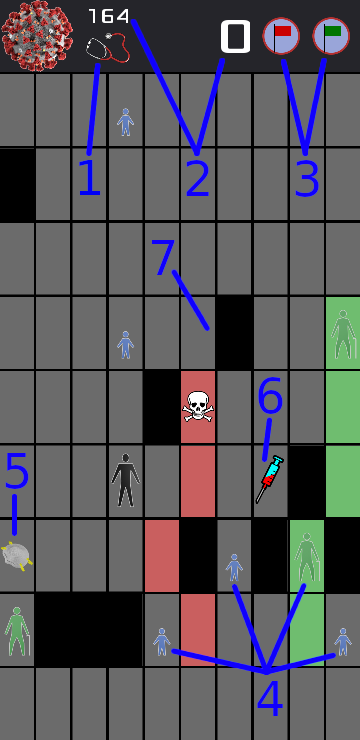

# Covid-19: A Puzzle Game

Now in testing.

## Privacy Statement

This game does not collect any data.

## Instructions

Your goal is to move all people from the bottom of the board to the top while avoiding or minimizing infections from the novel coronaviruses randomly scattered around the board.  A level ends when everybody is in the top row or dead.  If anybody remains healthy, the level resets with the healthy people at the bottom again.  The game ends when everyone dies or becomes infected, or if your remaining time reaches zero.

Touch a person to make that person active (indicated with yellow highlighting).  Move the active person by touching adjacent board positions.  Alternatively, you can touch and drag, but be very careful because it is easy to "fat finger" a person into an unintended location.

As viruses are invisible to the naked eye, you must infer their locations.  If a person begins showing symptoms, the person came into direct contact with the virus or stood adjacent to an infected person.  Infected people spread the virus around the board when they move.

Try to maximize your score, which updates after each level.  The people worth the most points are the people demographically most likely to die from Covid-19.  In order of highest to lowest points: elders, men, women, children.  An infected person is worth half as many points as the same person uninfected.

1. Stethoscope
2. Remaining time (left, in seconds), and score
3. Danger (red)/Safe (green) markers
4. People to move
5. Mask
6. Vaccine
7. Obstacle

Use the stethoscope to show you who is infected.  It costs 5 seconds of remaining time, but you don't have to wait for anybody to show symptoms.  You can use the "danger" and "safe" markers to annotate board positions.  For example, if a person is showing symptoms, that board position is definitely infected.  Annotate "danger" so you don't lose this information after the person moves elsewhere.

Acquiring a mask reduces the probability of spreading the virus between adjacent people.  The probability is lowest when both people have a mask.  Acquiring the vaccine spares a person from infection 3 times.  A person does not retain the benefit of these power-ups after a level concludes.

## Report a Bug / Request a Feature

The best way to report a bug, or to request a feature, is to [file an issue on Github](https://github.com/kalbfled/kalbfled.github.io/issues).  Be sure to tag your issue with the "covid-19-puzzle" label.  Please provide appropriate supporting documentation, such as screenshots and steps to reproduce.
